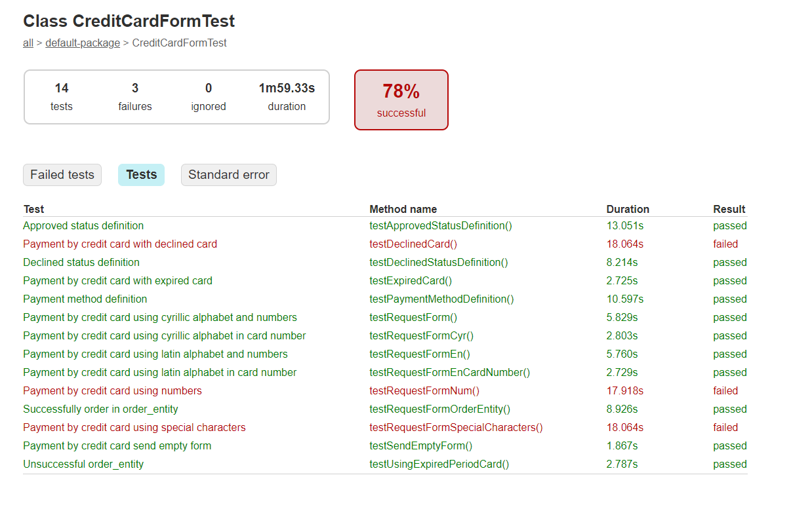
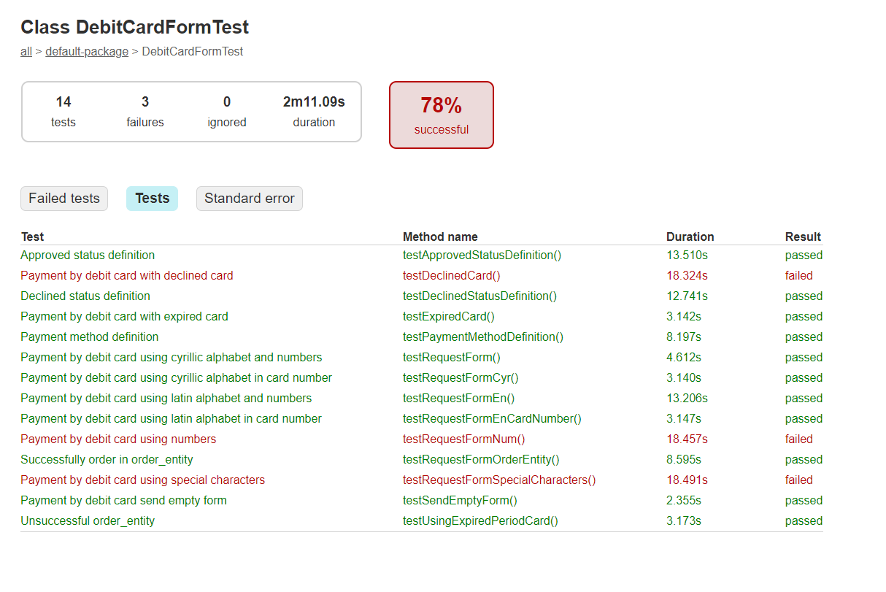
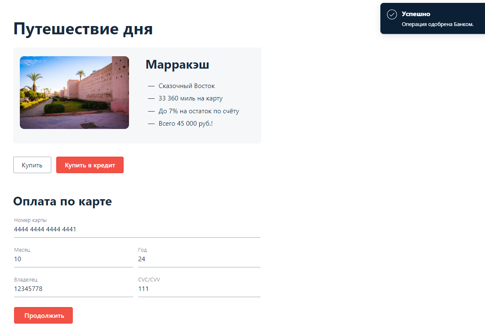
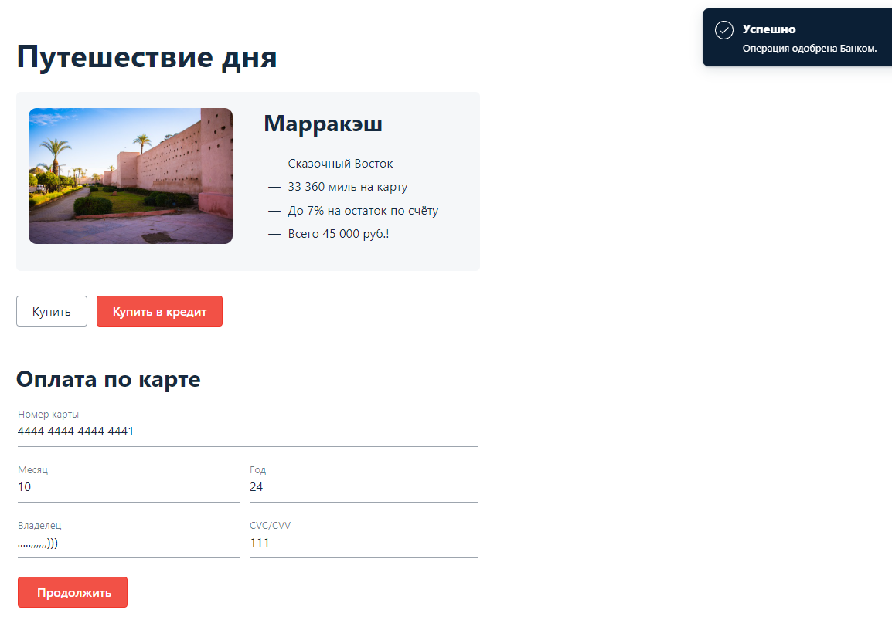

**_Отчет о тестировании._**
1. **Краткое описание:** 

Проведено тестирование приложения, которое представляет собой веб-сервис, который предлагает купить тур по определённой цене двумя способами:
- Обычная оплата по дебетовой карте.
- Уникальная технология: выдача кредита по данным банковской карты.

Приложение в собственной СУБД сохраняет информацию о том, успешно ли был совершён платёж и каким способом. Данные карт при этом не сохраняются.
В ходе тестирования использован метод черного ящика, критического пути, тестирование формы.
2. **Количество тест-кейсов:**

В целях тестирования была осуществлена автоматизация 28 тестов (14 тестов при оплате дебетовой картой, 14 тестов при оплате кредитной картой).
3. **Процент успешных и не успешных тест-кейсов:**

В каждом разделе процент успешного выполнения тестов составляет 78%. 

Процент проваленных тестов равен 22%. Падение тестов обусловлено наличием дефектов в приложении, а именно:
- приложение пропускает и успешно обрабатывает отклоненную карту;
  
- приложение позволяет ввести и принимает имя владельца карты, написанное цифрами;

- приложение позволяет ввести и принимает имя владельца карты, написанное спецсимволами;

4. **Общие рекомендации:** 
Необходимо устранить выявленные в результате тестирования дефекты. По мнению тестировщика, они являются критическими, т.к. приложение обрабатывает и одобряет заявки на заведомо не существующие карты и людей.
